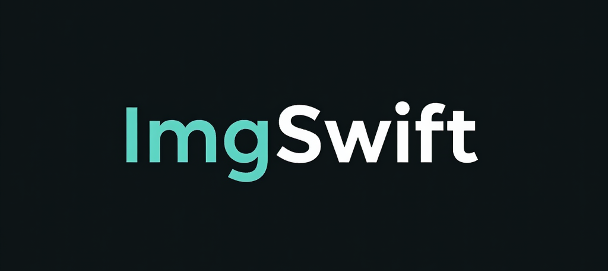

# ImgSwift



ImgSwift is a fast, efficient command-line image processing tool written in Rust for macOS. It provides simple commands for resizing images, changing DPI, converting formats, and compressing JPEG files.

## Features
- Resize images with high-quality Lanczos3 filtering
- Basic DPI adjustment
- Format conversion (JPG, PNG, WebP)
- JPEG compression with quality control
- Small executable size (~2-3MB when stripped)
- Fast processing thanks to Rust's performance

## Installation

### Prerequisites
- Rust (install via [rustup](https://rustup.rs/))
- macOS

### Steps
1. Clone or download this repository:
```bash
git clone https://github.com/makalin/imgswift.git
cd imgswift
```

2. Build the project:
```bash
cargo build --release
```

3. (Optional) Install to `/usr/local/bin` for global access:
```bash
cp target/release/imgswift /usr/local/bin/
```

4. (Optional) Reduce binary size:
```bash
strip /usr/local/bin/imgswift
```

## Usage

Run `imgswift` without arguments to see the help menu:
```bash
imgswift
```

### Commands

1. **Resize Image**
```bash
imgswift resize <input> <output> <width> <height>
```
Example: `imgswift resize input.jpg output.jpg 800 600`

2. **Change DPI**
```bash
imgswift dpi <input> <output> <dpi>
```
Example: `imgswift dpi input.png output.png 300`

3. **Convert Format**
```bash
imgswift convert <input> <output> <format>
```
Supported formats: jpg, png, webp
Example: `imgswift convert input.png output.jpg jpg`

4. **Compress JPEG**
```bash
imgswift compress <input> <output> <quality>
```
Quality range: 0-100
Example: `imgswift compress input.jpg output.jpg 75`

## Examples

```bash
# Resize to 800x600
imgswift resize photo.jpg photo_small.jpg 800 600

# Convert PNG to JPEG
imgswift convert image.png image.jpg jpg

# Compress JPEG to 75% quality
imgswift compress large.jpg small.jpg 75

# Set DPI to 300
imgswift dpi document.png document_300dpi.png 300
```

## Limitations
- DPI adjustment is basic (metadata support limited without additional libraries)
- No AI upscaling in this version
- Compression only available for JPEG format
- Error handling is functional but minimal

## Development

To add features or modify the code:

1. Ensure Rust is installed
2. Edit `src/main.rs`
3. Update dependencies in `Cargo.toml` if needed
4. Test with:
```bash
cargo run -- <command> <args>
```

## Dependencies
- [image](https://crates.io/crates/image) v0.24.7 - Image processing library

## License
MIT License - feel free to use, modify, and distribute.

## Contributing
Pull requests welcome! Please include tests and update this README if adding new features.

---
Built with ❤️ using Rust by makalin
